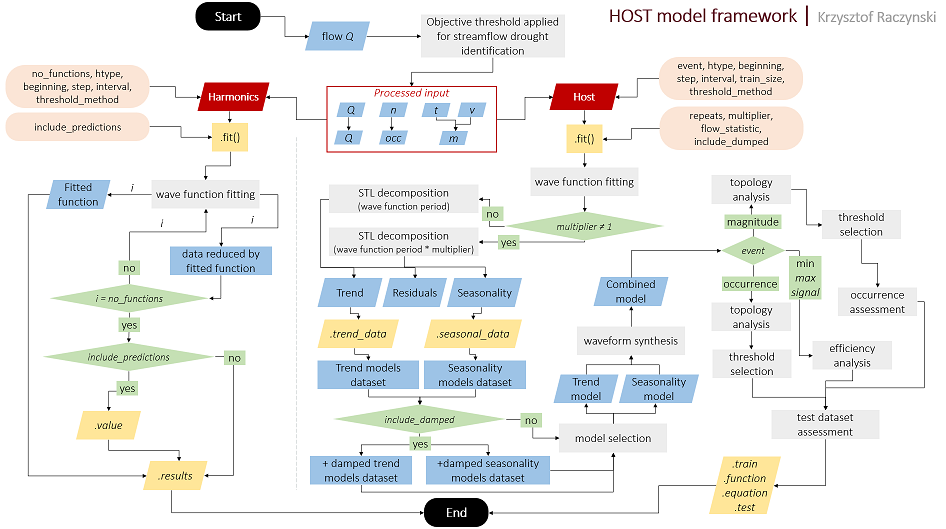

## Harmonic Oscillator Seasonal Trend (HOST) Model for analyzing the reoccurring nature of extreme events
<br/>

### Important notice
1/11/24: the code is currently under revision and modifications and updates are being tested. 
Current tasks: 
- [ ] code optimization, 
- [ ] changes in magnitude calculation 
- [ ] changes in topology analysis.
New version will be issued once tests are finished.

### Description
The Harmonic Oscillator Seasonal-Trend *hostmodel* is a Python package that allows for automated analysis and pattern recognition in time-series data with varying time domains. The software performs the decomposition of data into short- and long-term components and uses a range of modified wave functions to model both behaviors. Waveform synthesis is performed to compose the combined model, incorporating both components. The model allows for the extraction of n- harmonics from the data, or signal (representing any time-series data) analysis, as well as parametric assessment, that includes: (1) occurrence analysis (as binary classification) with related decision thresholds determined during topological analysis; (2) magnitude; and (3) values assessment. 
This package contains tools for full HOST model calculation according to following sheme:


This software can be used for a wide range of evenets analysis, examples include: flood occurrence, mean temperature distribution, hydrologic drought magnitude, volcano activity, occurrence of snow cover, migration scale, precipitation, seismic activity, reservoir supplementation under operational conditions and many more, on daily, monthly or annual scales. Please refer to publications listed below for more details.
<br/>
<br/>

### How to cite. 
If you use this package, please include the reference below [temporary reference]:
> Raczyński K., Dyer J., 2023, Harmonic oscillator seasonal trend (HOST) model for hydrological drought pattern identification and analysis, Journal of Hydrology, 620, B, 129514, https://doi.org/10.1016/j.jhydrol.2023.129514
<br/>

You can check below publications for details on HOST application: 
- Raczyński K., Dyer J., 202X, Harmonic Oscillator Seasonal-Trend Model For Analyzing the Reoccurring Nature of Extreme Events, (publication process)
- Raczyński K., Dyer J., 202X, Utilizing Waveform Synthesis in Harmonic Oscillator Seasonal-Trend Model For Short- and Long-term Streamflow Extremes Modelling And Forecasting, (publication process)
- Raczyński K., Dyer J., 2023, Harmonic oscillator seasonal trend (HOST) model for hydrological drought pattern identification and analysis, Journal of Hydrology, 620, B, 129514, https://doi.org/10.1016/j.jhydrol.2023.129514
<br/>
<br/>

### Website:
Official repository website address:
[https://github.com/chrisrac/hostmodel/](https://github.com/chrisrac/hostmodel/)
<br/>
<br/>

### Installation
Download the code from releases, unzip it and put it into you working directory for Python. 
Then use 'import host' within your code to use the framework. 
The pip installation for python, anaconda and other distributions will be released in the future.
Make sure you are using the latest release.
<br/>
<br/>

### Dependencies
The *hostmodel* package requires the following:
- numpy
- pandas
- scipy
- statsmodels
- objective_thresholds
<br/>
<br/>

### Usage
For detailed explanation of workflow and how to access results, please refer to [User Guides](https://github.com/chrisrac/hostmodel/tree/main/user_guides).

The general use of this model depends on the goal.
For calculation of Host models define the object as follows:
```
# for occurrence model, based on data saved in flow variable
# that uses low flow analysis, for daily data, starting from 
# '1-2-1979', aggregated to monthly outputs, and using 80%
# as trainig data:
host_model = host.Host(flow, 'lf', 'occurrence', '1-2-1979', 'D', 'M', 0.8, 'median') 
# or similarly for flow analysis:
host_model = host.Host(flow, 'lf', 'flow', '1-2-1979', 'D', 'M', 0.8)
```
For calculating Harmonic functions, similarly:
```
# for occurrence functions:
harmonic_model = host.Harmonics(flow, 'lf', 6, 'occurrence', '1-2-1979', 'D', 'M', 'median')  
# for flow analysis:
harmonic_model = host.Harmonics(flow, 'lf', 5, 'flow', '1-2-1979', 'D', 'M')
```
then use `.fit()` method on these objects to compute models or functions.
On information about additional parameters please refer to documentation and user guides.

If you encounter unresolved errors please use [Issues](https://github.com/chrisrac/hostmodel/issues) tab for reporting.
